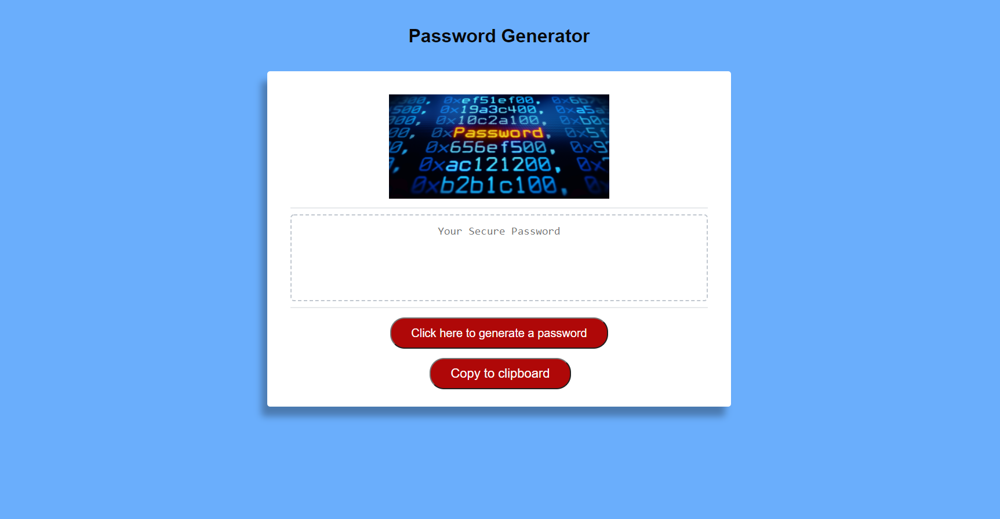

# Password-Generator

## Description 
```
This application will generator a random password for you. All you have to
do is click on the button and you'll be asked how many 
characters you would like and have the option to choose between 
lowercase, uppercase, numbers, and symbols.
Password needs to be at least 8 characters and a max of 128 characters.

```

## Table of Contents
* [Description](#description)
* [Installation](#installation)
* [Usage](#usage)
* [Credits](#credits)
* [License](#license)
* [Contributing](#Contributing)
* [Test](#Test)


## Installation
N/A

## Usage
---


## Credit
```
ANTHONY GUERRERO
```

## License
N/A

## Contributing
N/A


 ## Tests
N/A
 ## Questions

 

 If you have any questions about the project, repo, or any issue you can contact me at [Anthony Guerrero](https://github.com/knuckleh3ad89) directly.


